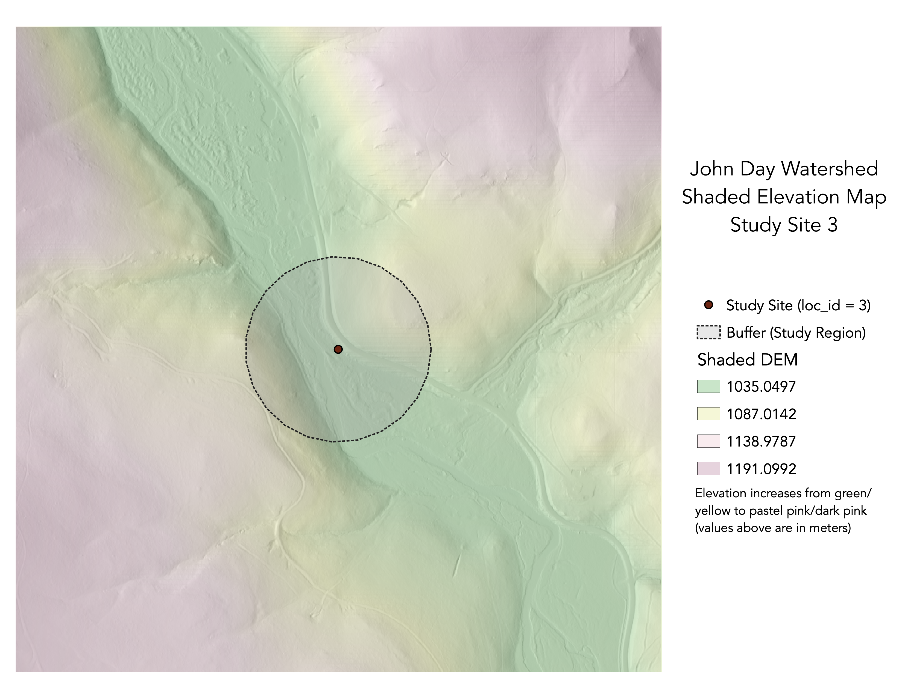
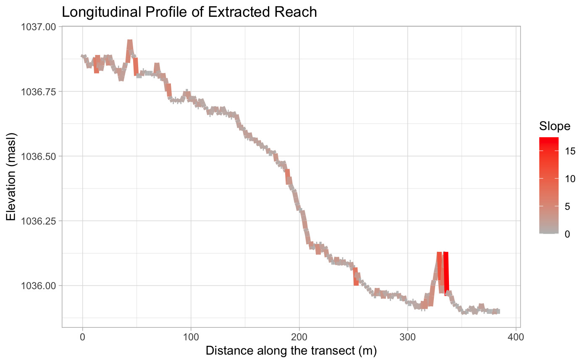
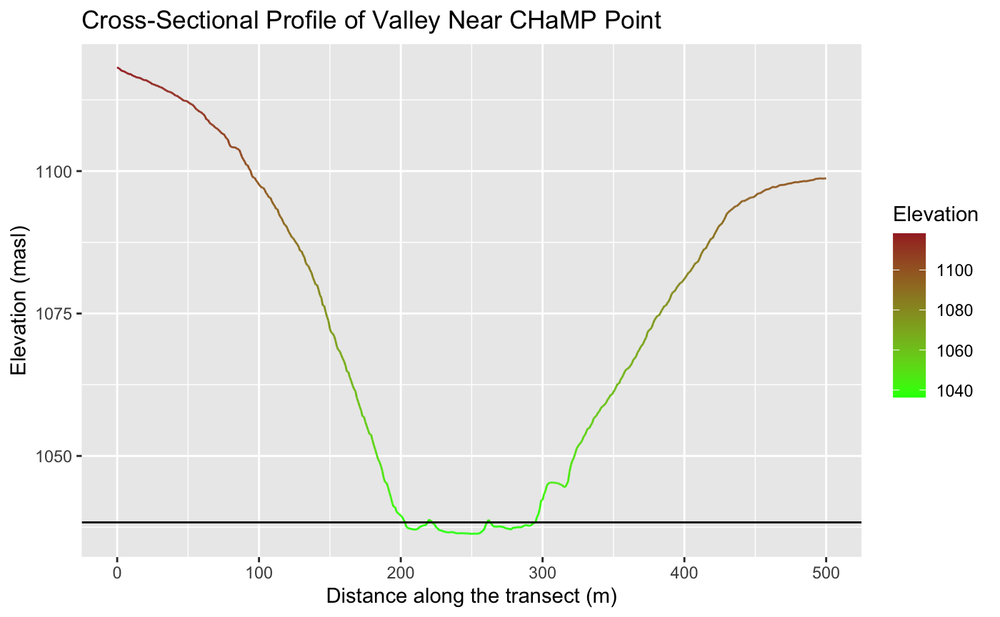

**Replication of**
# A classification of natural rivers

Original study *by* Rosgen, D. L.
*in* *CATENA* 22 (3):169–199. https://linkinghub.elsevier.com/retrieve/pii/0341816294900019.

and Replication by: Kasprak, A., N. Hough-Snee, T. Beechie, N. Bouwes, G. Brierley, R. Camp, K. Fryirs, H. Imaki, M. Jensen, G. O’Brien, D. Rosgen, and J. Wheaton. 2016. The Blurred Line between Form and Process: A Comparison of Stream Channel Classification Frameworks ed. J. A. Jones. *PLOS ONE* 11 (3):e0150293. https://dx.plos.org/10.1371/journal.pone.0150293.

Replication Authors: Drew An-Pham
Your Name, Zach Hilgendorf, Joseph Holler, and Peter Kedron.

Replication Materials Available at: [Re-Rosgen](https://github.com/daptx/RE-rosgen)

Created: `17 March 2021`
Last Revised: `23 March 2021`

## Abstract

## Original Study Information

## Analytical Plan

### Sampling Plan and Data Description

### Variables

### Analytical Specification

## Materials and Procedure

## Replication Results

Figures:

*figure a. map of the study site shaded elevation

*figure e. longitudinal profile graph with elevation & slope*

*figure f. cross-sectional profile graph*

Tables:

Table 1. Site Measurements
| Variable | Value | Source |
| :-: | :-: | :-: |
| Bankfull Width | 19.1587 | BfWdth_Avg in CHaMP_Data_MFJD |
| Bankfull Depth Average | 0.4242 | DpthBf_Avg in CHaMP_Data_MFJD |
| Bankfull Depth Maximum | 1.0001 | DpthBf_Max in CHaMP_Data_MFJD |
| Valley Width | 96 | Flood Prone-Width Graph in RStudio |
| Valley Depth | 2.0002 | calculation of MaxBFx2 |
| Stream/River Length | 385.2219 | banksLine attribute table in GRASS |
| Valley Length | 413.6928 | valleysLine attribute table in GRASS |
| Median Channel Material Particle Diameter | 42 | SubD50 in CHaMP_Data_MFJD |

Table 2. Rosgen Level I Classification
| Criteria | Value | Derivation |
| :-: | :-: | :-: |
| Entrenchment Ratio | 5.0108 | valley width / bankfull width from Table 1 |
| Width / Depth Ratio | 45.1643 | bankfull width / bankfull average depth from Table 1 |
| Sinuosity | 1.3072 | Sin in CHaMP_Data_MFJD, valleyLine length from GRASS appears 'off' b/c of buffer circumference |
| Level I Stream Type | C | The Key to the Rosgen Classification of Natural Rivers (Rosgen, 1994)[https://linkinghub.elsevier.com/retrieve/pii/0341816294900019] |

Table 3. Rosgen Level II Classification
| Criteria | Value | Derivation |
| :-: | :-: | :-: |
| Slope | .00257 | ΔElevation/ΔDistance in the (Longitudinal Profile)[RE-Rosgen/data/derived/public/longprof.txt] |
| Channel Material | Gravel | The Key to the Rosgen Classification of Natural Rivers (Rosgen, 1994)[https://linkinghub.elsevier.com/retrieve/pii/0341816294900019] |
| Level II Stream Type | C4b | The Key to the Rosgen Classification of Natural Rivers (Rosgen, 1994)[https://linkinghub.elsevier.com/retrieve/pii/0341816294900019] |

## Unplanned Deviations from the Protocol

## Discussion

## Conclusion

## References

Include any referenced studies or materials in the [AAG Style of author-date referencing](https://www.tandf.co.uk//journals/authors/style/reference/tf_USChicagoB.pdf).

####  Report Template References & License

This template was developed by Peter Kedron and Joseph Holler with funding support from HEGS-2049837. This template is an adaptation of the ReScience Article Template Developed by N.P Rougier, released under a GPL version 3 license and available here: https://github.com/ReScience/template. Copyright © Nicolas Rougier and coauthors. It also draws inspiration from the pre-registration protocol of the Open Science Framework and the replication studies of Camerer et al. (2016, 2018). See https://osf.io/pfdyw/ and https://osf.io/bzm54/

Camerer, C. F., A. Dreber, E. Forsell, T.-H. Ho, J. Huber, M. Johannesson, M. Kirchler, J. Almenberg, A. Altmejd, T. Chan, E. Heikensten, F. Holzmeister, T. Imai, S. Isaksson, G. Nave, T. Pfeiffer, M. Razen, and H. Wu. 2016. Evaluating replicability of laboratory experiments in economics. Science 351 (6280):1433–1436. https://www.sciencemag.org/lookup/doi/10.1126/science.aaf0918.

Camerer, C. F., A. Dreber, F. Holzmeister, T.-H. Ho, J. Huber, M. Johannesson, M. Kirchler, G. Nave, B. A. Nosek, T. Pfeiffer, A. Altmejd, N. Buttrick, T. Chan, Y. Chen, E. Forsell, A. Gampa, E. Heikensten, L. Hummer, T. Imai, S. Isaksson, D. Manfredi, J. Rose, E.-J. Wagenmakers, and H. Wu. 2018. Evaluating the replicability of social science experiments in Nature and Science between 2010 and 2015. Nature Human Behaviour 2 (9):637–644. http://www.nature.com/articles/s41562-018-0399-z.
