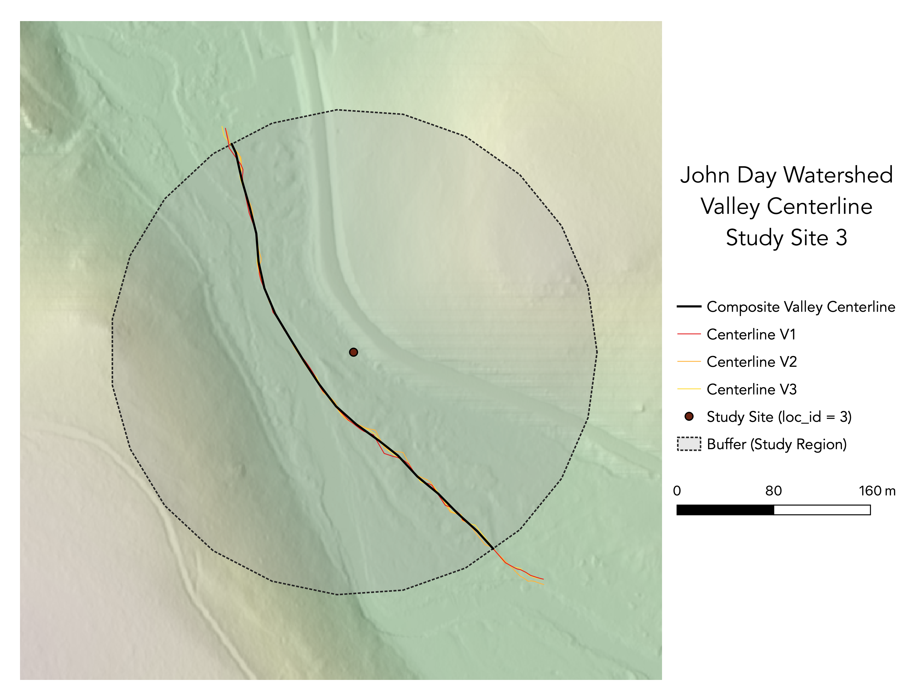

**Replication of**
# A classification of natural rivers

Original study *by* Rosgen, D. L.
*in* *CATENA* 22 (3):169–199. https://linkinghub.elsevier.com/retrieve/pii/0341816294900019.

and Replication by: Kasprak, A., N. Hough-Snee, T. Beechie, N. Bouwes, G. Brierley, R. Camp, K. Fryirs, H. Imaki, M. Jensen, G. O’Brien, D. Rosgen, and J. Wheaton. 2016. The Blurred Line between Form and Process: A Comparison of Stream Channel Classification Frameworks ed. J. A. Jones. *PLOS ONE* 11 (3):e0150293. https://dx.plos.org/10.1371/journal.pone.0150293.

Replication Authors: Drew An-Pham
Your Name, Zach Hilgendorf, Joseph Holler, and Peter Kedron.

Replication Materials Available at: [Re-Rosgen](https://github.com/daptx/RE-rosgen)

Created: `17 March 2021`
Last Revised: `23 March 2021`

## Abstract & Motivation

The classification of rivers and streams has served as a means to approach the long-standing discourse of understanding the dynamic physical processes that influence the patterns and characteristics of these features. The Rosgen Classification System (RCS), a stream-reach taxonomy commonly applied to streams/watersheds in North America, is a primary example of a standardized classification scheme that has been used to make streams more communicable and accessible across disciplines (geomorphology, conservation planning, engineering, so on so forth). Established in *A classification of natural rivers*, Rosgen (1994) created a classification hierarchy of 7 major stream type categories based on factors of entrenchment, gradient, width/depth ratio, and sinuosity. Each category was then iterated with sub-types, delineated by dominant channel material—pointing to a ‘final classification’.

In *The Blurred Lines between Form and Process: A Comparison of Stream Channel Classification Frameworks*, Kasprak et al. (2016) attempted to replicate and test the Rosgen Classification System (RCS), alongside 3 other classification frameworks. In their methodology, Kasprak et al. (2016) classified 33 Columbia Habitat Monitoring Program (CHaMP) reaches in the Middle Fork John Day Basin (MFJD; located in Oregon) using Levels I & II of the RCS, in addition to using 10 and 0.1-meter resolution DEMS and 1-meter resolution aerial imagery (implying the use of LiDAR).

Our study aims to replicate the results of Kasparak et al. (2016)—a replication of the Rosgen Classification in and of itself—using open source GIS (GRASS & QGIS) and statistical software (RStudio). Our replication uses both Columbia Habitat Monitoring Program (CHaMPs) data and the 1-meter resolution DEM LiDAR data for the study region to derive Level I & II classifications for a randomly assigned reach in the John Day River Watershed. While our software diverges from the original study, our end-goal remains to see whether these different methods create a synonymous stream type identification to Kasparak et al. (2016).

### Sampling Plan & Data Description

For this study, we were each assigned a random site from the original study to analyze. My designated stream reach was loc_id = 3.

*figure a. John Day Watershed Extent & CHaMP Sites Selected by Kasprak et al (2016)*

## Materials & Procedure
For this replication study, we utilized both GRASS and RStudio, following a workflow prepared and edited by Zach Hilgendorg—Geography Ph.D. Student @ ASU and Joesph Holler—Geography Professor @ Middlebury College.

The detailed procedures and protocols for our GRASS analysis can be found [here](https://github.com/daptx/RE-rosgen/blob/main/procedure/protocols/1-Research_Protocol_GRASS.pdf), while instructions for RStudio can be found [here](https://github.com/daptx/RE-rosgen/blob/main/procedure/protocols/3-Classifying.pdf), along with the respective [code](assets/2-ProfileViewer.Rmd)
Note: In order to complete this analysis on a MacOS device, please install [The Unarchiver](https://theunarchiver.com/) to access the [John Day Watersheds data](assets/JohnDayWShed) and [XCode](https://developer.apple.com/download/more/?=for%20Xcode) to download needed tools in GRASS.

Models used in GRASS:
[Center Line Calculations](assets/center_line_length.gxm) and [Visualization of Study Area](assets/visualize.gxm)

The classification scheme we followed (fulfilling Levels I & II)

## Replication Results

*Figures:*

*Tables:*
Table 1. Site Measurements
| Variable | Value | Source |
| :-: | :-: | :-: |
| Bankfull Width | 19.1587 | BfWdth_Avg in CHaMP_Data_MFJD |
| Bankfull Depth Average | 0.4242 | DpthBf_Avg in CHaMP_Data_MFJD |
| Bankfull Depth Maximum | 1.0001 | DpthBf_Max in CHaMP_Data_MFJD |
| Valley Width | 96 | Flood Prone-Width Graph in RStudio |
| Valley Depth | 2.0002 | calculation of MaxBFx2 |
| Stream/River Length | 385.2219 | banksLine attribute table in GRASS |
| Valley Length | 413.6928 | valleysLine attribute table in GRASS |
| Median Channel Material Particle Diameter | 42 | SubD50 in CHaMP_Data_MFJD |

Table 2. Rosgen Level I Classification
| Criteria | Value | Derivation |
| :-: | :-: | :-: |
| Entrenchment Ratio | 5.0108 | valley width / bankfull width from Table 1 |
| Width / Depth Ratio | 45.1643 | bankfull width / bankfull average depth from Table 1 |
| Sinuosity | 1.3072 | Sin in CHaMP_Data_MFJD |
| Level I Stream Type | C | The Key to the Rosgen Classification of Natural Rivers (Rosgen, 1994) |

Table 3. Rosgen Level II Classification
| Criteria | Value | Derivation |
| :-: | :-: | :-: |
| Slope | .00257 | ΔElevation/ΔDistance in the Longitudinal Profile |
| Channel Material | Gravel | The Key to the Rosgen Classification of Natural Rivers (Rosgen, 1994) |
| Level II Stream Type | C4b | The Key to the Rosgen Classification of Natural Rivers (Rosgen, 1994) |

## Unplanned Deviations from the Protocol

1. Slope was re-calculated from from the the longitudinal profile (ΔElevation/ΔDistance). In the original RStudio code, the slope was calculated as an average value based on the points derived from the reach centerline. However, due to digitizing errors, there were slope outliers (note the spike in slope ~330 m in the Longitudinal Profile of Extracted Reach graph) that skewed the slope average of the profile. By re-calculating slope using the starting and end points, this helped reduce digitizing uncertainty and yielded a more optimal/applicable value (.00257, as opposed to 1.2621).
2. Sinuosity was derived from the actual CHaMPs attribute table as opposed to using the formula channel length/valley length. When moving through the replication, my buffer was noticeably larger than other classmates and my cross-sectional profile appears to have taken on a shape where slightly higher banks develop surrounding a lower valley as seen [here](https://www.researchgate.net/figure/Natural-levees-exist-along-most-perennial-channels-subject-to-periodic-overbank-flooding_fig4_255619286), both of which could have influenced the valley length derived in GRASS.
- With this mind, the value I used was 1.3072 instead .9312 (the value that would've been produced using the values in Table 1)——which ended up altering the stream type, but ultimately made the most sense. The original sinuosity (.9312) and width / depth ratio (45.1643) would've placed my stream type as D (multiple channels), which wouldn't make sense based on the raster layers for my site—there's evidently a single-thread channel.

## Discussion

## Conclusion

## References

Include any referenced studies or materials in the [AAG Style of author-date referencing](https://www.tandf.co.uk//journals/authors/style/reference/tf_USChicagoB.pdf).

####  Report Template References & License

This template was developed by Peter Kedron and Joseph Holler with funding support from HEGS-2049837. This template is an adaptation of the ReScience Article Template Developed by N.P Rougier, released under a GPL version 3 license and available here: https://github.com/ReScience/template. Copyright © Nicolas Rougier and coauthors. It also draws inspiration from the pre-registration protocol of the Open Science Framework and the replication studies of Camerer et al. (2016, 2018). See https://osf.io/pfdyw/ and https://osf.io/bzm54/

Camerer, C. F., A. Dreber, E. Forsell, T.-H. Ho, J. Huber, M. Johannesson, M. Kirchler, J. Almenberg, A. Altmejd, T. Chan, E. Heikensten, F. Holzmeister, T. Imai, S. Isaksson, G. Nave, T. Pfeiffer, M. Razen, and H. Wu. 2016. Evaluating replicability of laboratory experiments in economics. Science 351 (6280):1433–1436. https://www.sciencemag.org/lookup/doi/10.1126/science.aaf0918.

Camerer, C. F., A. Dreber, F. Holzmeister, T.-H. Ho, J. Huber, M. Johannesson, M. Kirchler, G. Nave, B. A. Nosek, T. Pfeiffer, A. Altmejd, N. Buttrick, T. Chan, Y. Chen, E. Forsell, A. Gampa, E. Heikensten, L. Hummer, T. Imai, S. Isaksson, D. Manfredi, J. Rose, E.-J. Wagenmakers, and H. Wu. 2018. Evaluating the replicability of social science experiments in Nature and Science between 2010 and 2015. Nature Human Behaviour 2 (9):637–644. http://www.nature.com/articles/s41562-018-0399-z.
